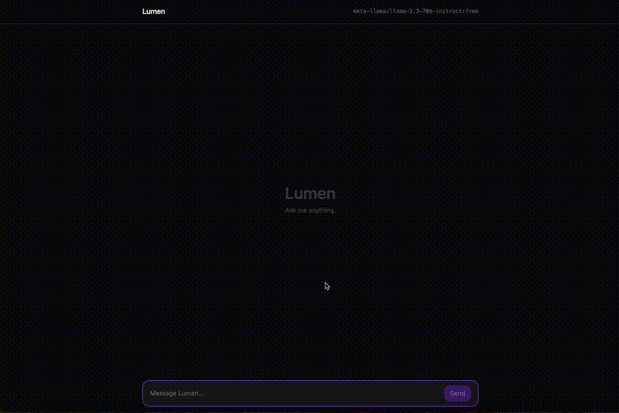
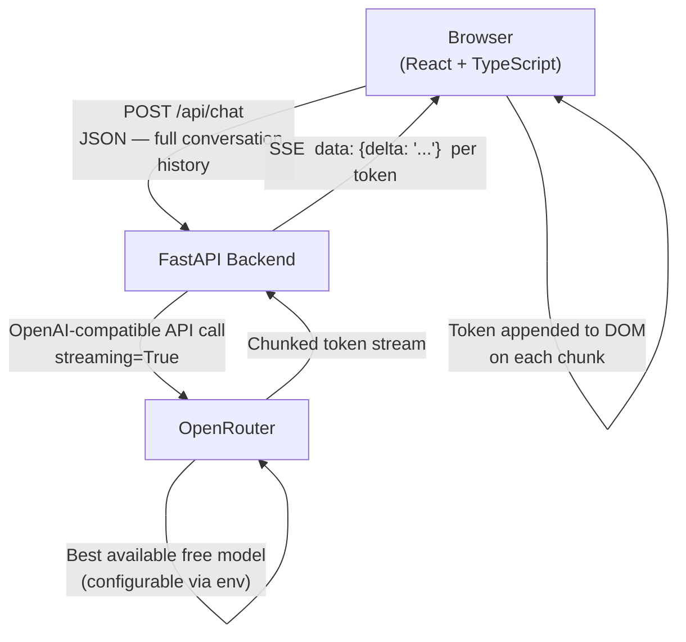

# Lumen

A full-stack AI chat assistant built with React, FastAPI, and OpenRouter — developed using a structured multi-agent Claude Code workflow.


---



---

## About

I built Lumen to showcase a production-shaped full-stack architecture for AI chat. It's not a tutorial clone — the design decisions here are intentional:

- **The backend is model-agnostic.** All AI traffic goes through FastAPI, which proxies to OpenRouter. The frontend never touches an API key. Swapping from Llama to GPT-4o or Claude 3.5 is a single environment variable change — no code touched.
- **Streaming is real, not simulated.** The backend forwards tokens from OpenRouter as a Server-Sent Events stream with no buffering. The frontend renders each token as it arrives using the Fetch streaming API.
- **The build process itself was multi-agent.** I used a team of three specialist Claude Code agents — product manager, UX designer, and frontend developer — with defined roles and structured handoffs. More on that below.

---

## Architecture



The frontend never holds an API key. All model configuration lives in `backend/.env`, read at startup. The OpenAI-compatible client in `chat_router.py` means any OpenRouter model — or any OpenAI-compatible provider — works without touching application code.

---

## Multi-Agent Claude Code Workflow

This is the part of the project I'm most interested in talking about.

I defined three specialist agents in `.claude/agents/`, each with a scoped role and a restricted tool set. Every feature followed the same handoff chain:

| Agent | Role | When invoked |
|---|---|---|
| `product-manager` | Defines the feature: user stories, acceptance criteria, explicit out-of-scope | Before any design or code |
| `ux-designer` | Names components, defines layout, chooses typography and color decisions | After PM spec is approved |
| `frontend-dev` | Implements React components, hooks, Tailwind styling, API integration | After UX spec is complete |

The PM agent cannot write code. The UX agent cannot touch the backend. The frontend agent does not freelance into product decisions. Each agent's system prompt enforces its lane.

The result is that AI-generated work arrives in the same shape that work from a real product team would arrive — as a spec, then a design, then an implementation. It forces clarity at each stage rather than letting the model jump straight to code with implicit assumptions baked in.

The agent definitions live in `.claude/agents/` and are checked into the repo. They're short — worth reading if you're curious about the prompting approach.

---

## Local Setup

**Prerequisites**

- Node 18+
- Python 3.11+
- [`uv`](https://docs.astral.sh/uv/getting-started/installation/) (fast Python package manager)
- An OpenRouter API key — [get one free at openrouter.ai/keys](https://openrouter.ai/keys), no credit card required

**Steps**

1. Clone the repo:

   ```bash
   git clone https://github.com/andrewmoyer/ai-assistant.git
   cd ai-assistant
   ```

2. Install all dependencies (frontend + backend in one command):

   ```bash
   make install
   ```

3. Create `backend/.env` from the example:

   ```bash
   cp backend/.env.example backend/.env
   ```

   Then open `backend/.env` and add your OpenRouter API key. The file is gitignored — it will never be committed.

4. Start both servers:

   ```bash
   make dev
   ```

   This runs the FastAPI backend on `http://localhost:8000` and the Vite dev server on `http://localhost:5173` concurrently. `Ctrl-C` stops both.

5. Open [http://localhost:5173](http://localhost:5173).

**Individual servers**

```bash
make backend    # FastAPI only (port 8000)
make frontend   # Vite only (port 5173)
```

---

## Configuration

All configuration lives in `backend/.env`.

| Variable | Default | Description |
|---|---|---|
| `OPENROUTER_API_KEY` | *(required)* | Your OpenRouter API key |
| `OPENROUTER_BASE_URL` | `https://openrouter.ai/api/v1` | API base URL — swap to any OpenAI-compatible provider |
| `DEFAULT_MODEL` | `openrouter/auto:free` | Any model string from [openrouter.ai/models](https://openrouter.ai/models) |
| `APP_NAME` | `Lumen` | Display name shown in the UI header |

The `DEFAULT_MODEL` value is read at request time in `chat_router.py`. To run against GPT-4o, Claude 3.5 Sonnet, or Gemini Flash, change one line in `.env` and restart the backend. No application code changes.

---

## How It Works

### SSE Streaming

The backend's `POST /api/chat` endpoint returns a FastAPI `StreamingResponse` with `media_type="text/event-stream"`. Each token received from OpenRouter is immediately forwarded to the client as:

```
data: {"delta": "token text here"}\n\n
```

No buffering. The stream closes with `data: [DONE]`.

On the frontend, `streamChat()` in `api/client.ts` uses the Fetch API with a `ReadableStream` reader piped through `TextDecoderStream` — not `EventSource`, which would restrict the request to GET and prevent sending a JSON body. The raw byte stream is decoded and split on newlines with a carry-buffer to handle chunks that land mid-line.

Token deltas are accumulated in a `useRef` inside `useChat.ts` rather than being concatenated directly in state. This avoids a stale closure problem: if the `onToken` callback closed over state, each call would see the value from the render in which the stream started. The ref is mutable and always current, so every token appends to the right string regardless of how many renders have happened since the stream began.

In-flight streams are cancelled via `AbortController`. When the user sends a new message before the previous response completes, the old stream is aborted and the new one takes over.

### Focus Restore After Streaming

After a response finishes streaming, the input bar needs to regain focus so the user can type immediately. The naive approach — `setTimeout(() => inputBarRef.current?.focus(), 0)` — has a race condition: the zero-millisecond timeout fires during the same browser task queue turn as the React state update, before React has committed `disabled={false}` to the DOM. The textarea is still disabled when `focus()` runs, so the browser silently ignores it.

The fix, in `ChatPage.tsx`, uses `useEffect` watching `isStreaming`:

```tsx
const prevIsStreamingRef = useRef(false)
useEffect(() => {
  if (prevIsStreamingRef.current && !isStreaming) {
    inputBarRef.current?.focus()
  }
  prevIsStreamingRef.current = isStreaming
}, [isStreaming])
```

`useEffect` runs after React commits the DOM. By the time `focus()` is called, the textarea already has `disabled={false}` applied — guaranteed. The `prevIsStreamingRef` tracks the previous value so the effect only fires on the `true → false` transition, not on every render.

---

## Project Structure

```
ai-assistant/
├── backend/
│   ├── main.py                  # FastAPI app, CORS config, router registration
│   ├── routers/
│   │   └── chat_router.py       # POST /api/chat — StreamingResponse SSE endpoint
│   ├── models/
│   │   └── chat.py              # Pydantic request/response models
│   ├── .env.example             # Template — copy to .env and fill in key
│   └── requirements.txt
│
├── frontend/
│   └── src/
│       ├── api/
│       │   └── client.ts        # streamChat() — Fetch + ReadableStream SSE parser
│       ├── components/
│       │   ├── ChatPage.tsx     # Root layout, focus-restore logic
│       │   ├── ChatWindow.tsx   # Scrollable message container
│       │   ├── MessageList.tsx  # Maps messages → MessageItem
│       │   ├── MessageItem.tsx  # Individual message bubble
│       │   ├── InputBar.tsx     # Auto-resize textarea, forwardRef handle
│       │   ├── AppHeader.tsx    # Title bar with active model display
│       │   ├── SendButton.tsx   # Submit control
│       │   ├── StreamingCursor.tsx  # Animated cursor during streaming
│       │   └── EmptyState.tsx   # Shown before first message
│       ├── hooks/
│       │   └── useChat.ts       # All streaming state, AbortController, history
│       ├── types/
│       │   └── index.ts         # Shared TypeScript interfaces
│       └── main.tsx
│
├── .claude/
│   └── agents/
│       ├── product-manager.md   # PM agent — features, acceptance criteria
│       ├── ux-designer.md       # UX agent — naming, layout, typography
│       └── frontend-dev.md      # Dev agent — React, hooks, Tailwind
│
├── Makefile                     # make dev / make install / make backend / make frontend
└── CLAUDE.md                    # Project rules, architecture notes, agent guidance
```

---

## Roadmap

- Conversation persistence (localStorage or a lightweight DB)
- Model selector in the UI — surface the model-agnostic architecture to the user
- Markdown rendering in assistant message bubbles
- Mobile-responsive layout
- Streaming cancellation button mid-response

---

## License

MIT — see [LICENSE](./LICENSE).

---

Built by [Andrew Moyer](https://github.com/andrewmoyer)
